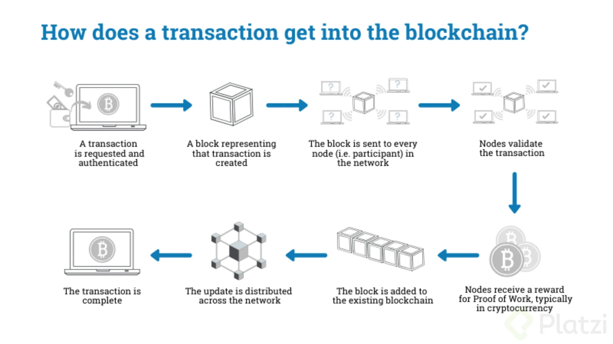

Here are the 1st week's challenges

1. Generates the process flow for the operation of a lift/elevator, optimizing as many resources as possible.

[flow process elevator](https://whimsical.com/logica-ascensor-CsQDzBzySD5WWdqSqN4xz4).

2. Make a list of the words you don't know from the following image and look for their definition.

3. Explain in a tweet -less than 280 characters- each of the following concepts:

Scalability.
Optimization.
Processes.
Systems.
Operations. 